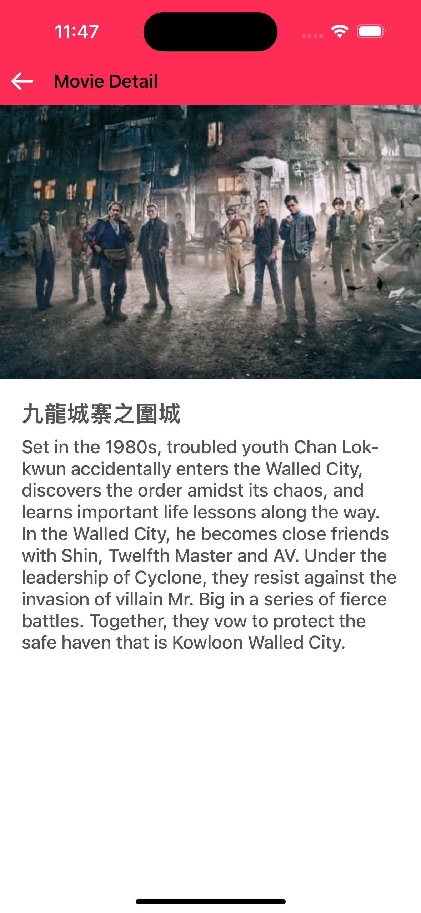

# MoviesApp-MVVM-Coordinator

## Overview

This iOS app demonstrates the use of the **MVVM (Model-View-ViewModel)** design pattern with the **Coordinator** pattern for navigation. The app displays a list of movies, and on clicking a movie, it navigates to a detailed view.

### Features

- Display a list of movies fetched from an API.
- Navigate to a movie's detail view using the Coordinator pattern.
- Uses MVVM for separation of concerns and testability.

### Design Patterns

- **MVVM (Model-View-ViewModel)**
- **Coordinator** for handling navigation between screens.

### Screenshots



### Requirements

- Xcode 13+
- iOS 14+
- Swift 5.0+
### Installation

1. Clone the repository:
   ```bash
   git clone https://github.com/BilaalAnwar/MoviesApp-MVVM-Coordinator.git
