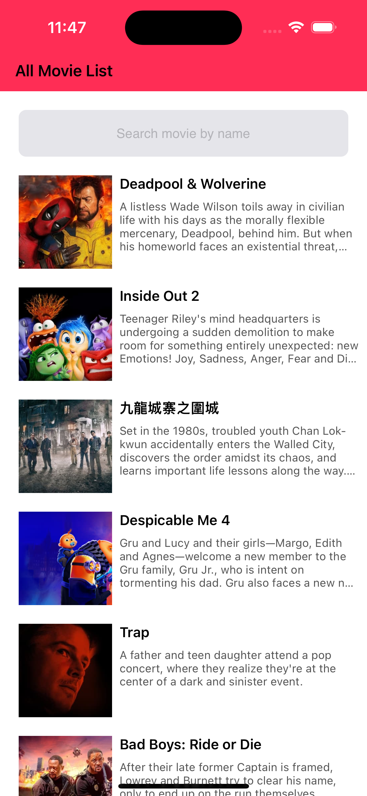

# MoviesApp-MVVM-Coordinator

## Overview

This iOS app demonstrates the use of the **MVVM (Model-View-ViewModel)** design pattern with the **Coordinator** pattern for navigation. The app displays a list of movies, and on clicking a movie, it navigates to a detailed view.

### Features

- Display a list of movies fetched from an **API Client** and **Mock Response** for development and testing purposes.
- Navigate to a movie's detail view using the **Coordinator** pattern to handle navigation logic cleanly and efficiently.
- Implements the **MVVM (Model-View-ViewModel)** architecture for separation of concerns, testability, and maintainability.

### Project Structure

- **APIClient**: Contains the network logic and services responsible for fetching movie data from an external API.
- **MockAPIClient**: Provides mock movie data for testing and development environments without making real network calls.
- **Models**: Defines the data models representing the movie information.
- **ViewModels**: The layer that acts as a bridge between the model and view, managing the movie data and business logic.
- **Views**: Handles the UI components and displays the movie list and details.
- **Coordinator**: Manages the navigation between different views.
- **Services**: Additional services for handling tasks such as API interaction and data parsing.


### Design Patterns

- **MVVM (Model-View-ViewModel)**
- **Coordinator** for handling navigation between screens.

### Screenshots



### Requirements

- Xcode 13+
- iOS 14+
- Swift 5.0+
### Installation

1. Clone the repository:
   ```bash
   git clone https://github.com/BilaalAnwar/MoviesApp-MVVM-Coordinator.git
